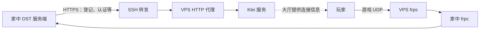

# 饥荒 FRP 直连很快，大厅加入却很慢？让大厅登记与 FRP 使用同一个公网出口

**FRP 解决了“怎么连进来”，还需要检查大厅告诉玩家“连到哪里”。**

如果 `c_connect("VPS公网IP", 10999)` 很快，而从服务器列表点击加入很慢，可以尝试：**用 VPS 上的 HTTP 代理发送服务端的 HTTPS 请求，让大厅看到 VPS 的出口 IP；玩家的游戏 UDP 流量继续由 FRP 转发。**

玩家正常搜索房间、点击加入，不需要安装额外软件。前提是大厅最终使用了正确的入口，而且地面、洞穴都验证通过。

这是 Klei 开发者在论坛提出的绕行思路，不是自定义公网 IP 的官方配置项。2024-11-27，开发者 nome 解释了 `https_proxy` 与 HTTPS、UDP 两类通信的关系；2024-12-03，玩家 clearlove 报告通过 Proxychains 实现过同类目标，但明确没有测试环境变量方式。[开发者解释](https://kleiforums.com/forums/topic/161083-request-permission-to-customize-the-independent-server-ipdomain-in-browse-games/#findComment-1762838)、[玩家反馈](https://kleiforums.com/forums/topic/161083-request-permission-to-customize-the-independent-server-ipdomain-in-browse-games/#findComment-1767709)。

本文将这个思路整理为可复现的配置流程。**资料核对：2026-10-03；未在真实 DST 双世界服务器上完成端到端实测。** 原论坛已归档，游戏更新后仍应重新验收，不能把文中的示例当成当前版本的成功记录。

## 适用范围

- 已有可正常运行、切换地面和洞穴的饥荒联机版独立服务端。
- 已有一台具备公网 IPv4 的 VPS，运行 `frps`；家中机器运行 `frpc`。
- 玩家从外网手动连接 VPS 地址正常，但大厅加入存在连接或延迟问题。
- VPS 使用 Ubuntu/Debian；本地可以是 Mac mini 或 Linux。Docker 部署见[容器附录](docker.md)。

如果手动直连也慢，先查 VPS 线路、UDP 转发、家庭上行和服务端负载；改变大厅出口不会修复这些问题。使用第三方 FRP 服务时，还需要能提供**与 UDP 公网入口具有相同出口 IP**的代理，通常需要服务商配合。

## 先理解两条路径



`https_proxy` 改变支持该变量的 HTTPS 请求出口，不转发游戏 UDP。它还会影响该进程其他 HTTPS 请求，因此代理需要在整个服务运行期间可用。

最容易忽略的三件事：

1. **IP 对齐**：代理向外访问时的源 IP，要与玩家访问的 FRP 公网 IPv4 相同。多网卡、NAT、多出口 VPS 尤其需要核对。
2. **端口对齐**：本教程让 DST 玩家端口、Docker 发布端口和 FRP 公网端口保持相同。
3. **进程对齐**：地面和洞穴进程都必须继承代理变量，并能访问代理地址。

## 1. 核对世界端口，不要混淆三类端口

先备份整个世界目录、启动脚本和现有 FRP 配置。世界目录以实际启动参数为准，不要仅凭平台默认路径判断。

```text
你的世界目录/
├── cluster.ini
├── cluster_token.txt
├── Master/server.ini
└── Caves/server.ini
```

| 用途 | 本文示例 | 是否加入本文 FRP 玩家转发 |
| --- | --- | --- |
| 地面玩家连接：`Master/server.ini` 的 `server_port` | UDP 10999 | 是 |
| 洞穴玩家连接：`Caves/server.ini` 的 `server_port` | UDP 10998 | 是 |
| 分片互联：`cluster.ini` 的 `master_port` | UDP 10888 | 保持现有内部通信，不向玩家公开 |
| Steam 的 `master_server_port`、`authentication_port` | 保持现有值 | 与玩家端口分开处理，按部署需求和日志检查 |

只核对或修改已有 `[NETWORK]` 下的值，别重复创建配置节：

```ini
# Master/server.ini
[NETWORK]
server_port = 10999
```

```ini
# Caves/server.ini
[NETWORK]
server_port = 10998
```

**启动命令里的 `-port` 会覆盖 `server.ini`。** 检查服务端日志中的实际 `ServerPort`，不能只看文件。同一机器上的各分片还要避免 Steam 端口冲突；不要为了穿透随意改洞穴 `id`。[Klei 启动参数](https://support.klei.com/hc/en-us/articles/360029556192-Dedicated-Server-Command-Line-Options-Guide)、[设置指南](https://kleiforums.com/forums/topic/64552-dedicated-server-settings-guide/)。

## 2. FRP 转发地面和洞穴的 UDP

本文使用 TOML 配置，FRP 从 v0.52.0 开始支持该格式。现有 FRP 正常运行时，保留认证和传输设置，只合并以下两条代理。[FRP 配置与校验](https://gofrp.org/en/docs/features/common/configure/)。

本地 `frpc.toml`：

```toml
[[proxies]]
name = "dst-master"
type = "udp"
localIP = "127.0.0.1"
localPort = 10999
remotePort = 10999

[[proxies]]
name = "dst-caves"
type = "udp"
localIP = "127.0.0.1"
localPort = 10998
remotePort = 10998
```

这要求 frpc 能通过本地回环地址访问游戏端口。Docker 下，宿主机 frpc 访问宿主机发布的 UDP 端口；容器内 frpc 则使用实际游戏服务名或共享网络中的地址。不能跨容器照抄 `127.0.0.1`。[FRP UDP 示例](https://gofrp.org/en/docs/examples/dns/)。

VPS 需要允许：

- TCP 7000：本文示例的 FRP 控制连接，实际以 `bindPort` 为准。
- UDP 10999、10998：玩家连接，云安全组与系统防火墙都要允许。
- TCP SSH 端口：供你建立代理隧道；默认 22，实际以服务器为准。

**不需要把代理的 TCP 8888 开放到公网。** 不要为测试关闭整个防火墙。如果 frps 设置了 `allowPorts`，还要把两个玩家端口加入允许范围。完整的新建示例在 [examples/frp](../examples/frp/)，已有服务不要直接覆盖。

在对应机器上校验并按原有方式重启：

```bash
frps verify -c /你的路径/frps.toml
frpc verify -c /你的路径/frpc.toml
```

找一名外网玩家，在客户端控制台输入：

```lua
c_connect("VPS公网IP", 10999)
```

进入地面后去洞穴、再返回地面。此时若失败，先修复 FRP 和分片通信，再继续配置大厅出口。

## 3. VPS 安装 HTTP 代理，只监听本机

在 VPS 执行：

```bash
sudo apt update
sudo apt install tinyproxy
sudo cp /etc/tinyproxy/tinyproxy.conf /etc/tinyproxy/tinyproxy.conf.before-dst
sudo nano /etc/tinyproxy/tinyproxy.conf
```

修改已有选项，删除冲突的监听或访问规则；保留发行版提供的 `User`、`Group`、日志等配置：

```conf
Port 8888
Listen 127.0.0.1
Allow 127.0.0.1
ConnectPort 443
```

`ConnectPort 443` 允许通过 HTTP CONNECT 访问 HTTPS 目标。Tinyproxy 是 HTTP 代理，下面的 URL 使用 `http://`，目标请求仍然是 HTTPS。[Tinyproxy 配置说明](https://tinyproxy.github.io/)。

```bash
sudo systemctl restart tinyproxy
sudo systemctl enable tinyproxy
sudo systemctl status tinyproxy --no-pager
sudo ss -lntp 'sport = :8888'
curl --fail --show-error --silent --noproxy '' \
  --connect-timeout 5 --max-time 15 \
  --proxy http://127.0.0.1:8888 https://api.ipify.org
```

验收：监听地址是 `127.0.0.1:8888`，查询返回的 IPv4 与 FRP 公网入口一致。这里使用 ipify 作为出口检测服务，**这个检查不代表 DST 已经采用代理**。不要把此配置片段当成完整的 Tinyproxy 配置文件覆盖系统原文件。

双栈或多出口 VPS 上，ipify 的 IPv4 结果也不能证明所有目标使用相同出口。若 Klei 请求实际从另一地址发出，可按 Tinyproxy 的 `Bind` 说明绑定正确的 **VPS 本地出站 IPv4**并复查；云服务器使用 NAT 时，该地址可能不同于面向玩家的公网 IPv4。

## 4. 本地通过 SSH 访问 VPS 代理

**游戏在 Docker 中运行：跳到[容器附录](docker.md)，不要照抄本节的宿主机回环地址。**

游戏进程直接运行在本地系统时，打开终端 A，保持以下命令运行：

```bash
ssh -NT \
  -o ExitOnForwardFailure=yes \
  -o ServerAliveInterval=30 \
  -o ServerAliveCountMax=3 \
  -L 127.0.0.1:8888:127.0.0.1:8888 \
  你的VPS用户名@你的VPS地址
```

SSH 使用现有登录方式；首次连接先核对服务器主机密钥指纹。左边 `127.0.0.1:8888` 是本地监听，右边是 VPS 上的 Tinyproxy。SSH 只搬运代理的 TCP 连接，游戏 UDP 仍走 FRP。[OpenSSH 转发说明](https://man.openbsd.org/ssh)。

在终端 B 测试：

```bash
curl --fail --show-error --silent --noproxy '' \
  --connect-timeout 5 --max-time 15 \
  --proxy http://127.0.0.1:8888 https://api.ipify.org
```

返回值同样应是 FRP 公网入口 IPv4。`ExitOnForwardFailure` 只帮助发现转发监听建立失败，不能证明远端 Tinyproxy 正常，所以这一步不能省。[OpenSSH 配置说明](https://man.openbsd.org/ssh_config)。

## 5. 让两个游戏进程继承 `https_proxy`

停止原来的两个游戏进程，确认没有重复实例。在能访问代理的终端中，为原启动命令设置变量：

```bash
export https_proxy=http://127.0.0.1:8888
export no_proxy=localhost,127.0.0.1
export NO_PROXY=localhost,127.0.0.1

# 从这里执行你原来已经可以工作的地面、洞穴启动命令
```

也可以用本仓库的包装脚本启动已有命令：

```bash
bash scripts/with-proxy.sh /你的路径/原启动脚本.sh
```

如果原脚本没有可执行权限，用 `bash scripts/with-proxy.sh bash /你的路径/原启动脚本.sh`。游戏程序需要原来的工作目录时，先 `cd` 到该目录，再使用包装脚本的绝对路径。包装脚本保留参数与退出码，并先检查代理请求是否成功。

变量应设在**实际负责启动 DST 的环境**里。桌面应用、launchd、systemd、Docker 等不会因为另一个终端执行了 `export` 就自动获得新变量；`sudo` 或启动脚本也可能清理环境。应在服务定义或启动脚本中持久化，并重新启动游戏进程。

检查原有 `no_proxy` / `NO_PROXY`，不要包含 `*` 或 Klei 域名，否则请求可能绕过代理。变量 `https_proxy` 使用小写，值使用 `http://`；变量名指目标请求类型，URL 前缀指代理类型。[libcurl 环境变量](https://curl.se/libcurl/c/libcurl-env.html)、[代理 URL](https://curl.se/libcurl/c/CURLOPT_PROXY.html)。

## 6. 怎么证明玩家实际走了 FRP

**能搜到房间、能进入游戏、Ping 数值变好，都不能单独证明整条链路成功。**

在 VPS 开始抓包，找一名外网玩家，从大厅点击加入：

```bash
sudo tcpdump -ni any -nn 'udp port 10999 or udp port 10998'
```

按顺序验收：

1. 在游戏所在环境查询代理出口，返回 FRP 入口 IPv4。
2. 重启两个游戏进程后，Tinyproxy 日志里出现与启动/登记时间对应的 Klei HTTPS CONNECT 请求。日志位置以实际配置为准。
3. 外网玩家从**服务器列表**点击加入；VPS 出现与该玩家操作对应的 UDP 请求和回应。
4. 玩家已进入地面后，地面端口出现持续的双向游戏通信。只有几条探测包不算通过。
5. 去洞穴、返回地面，核对 UDP 10998、10999 上分别出现持续通信，游戏内无异常延迟或断线。
6. 按“代理 → FRP → 游戏”的顺序恢复服务，重新从大厅加入并完成双向世界切换。

用玩家出口 IP、操作时间和端口关联抓包；必要时在家中对应端口同步抓包。不要把别人的探测流量当成本次游戏通信。若能查看客户端连接记录或大厅条目，也应核对目标 IP、端口；不要凭空假定存在某个游戏内 IP 字段。

Ping 显示 `???` 是进一步检查入口的线索。TCP 的 `nc -z` 不能测试游戏 UDP，`nc -u` 没报错也不代表游戏握手完成。排障见[故障表](troubleshooting.md)。

## 长期运行与撤回

验证通过后，再把 SSH 隧道、frpc 和两个游戏进程交给现有进程管理器。SSH keepalive 能发现断线，**不会自动重连**；使用管理器重启隧道。代理恢复后如大厅信息未更新，重新启动两个游戏进程并验收。Mac 还需避免系统睡眠使整套服务中断。

撤回时，移除实际游戏启动环境中的代理变量，恢复原启动方式并重启两个进程。Docker 则删除新增环境和代理依赖，重建相应容器；保留已有存档卷。正常停止本次新增的隧道即可，现有 FRP 可继续使用。

如果代理出口、进程环境都正确，但大厅仍未使用 VPS，记录版本与证据再反馈；不要循环猜配置项。需要更完整的出口控制时，可研究 WireGuard 加 VPS 路由与转发；VPS 算力足够时，也可直接迁移服务端。这两条路径需要另外设计，本文不提供未经验证的一键配置。
